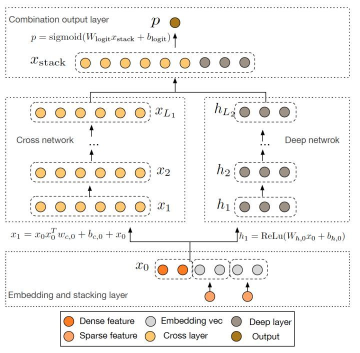
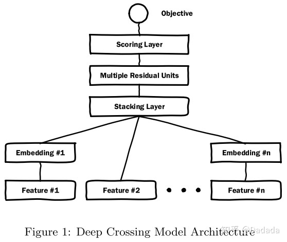

模型结构图：

模型理解：

1. 把稀疏特征embedding化 （由于维度高，这部分参数会很多）
2. 左侧对embedding后的参数做交叉（这部分参数较少，为embedding维度*n层），右侧直接做DNN （左侧和右侧比，多了一种类似的残差结构）
3. concate起来，然后sigmoid

**右侧DNN中的MLP结果，是有一定的特征交叉能力的，这种特征交叉的能力是比较弱的，MLP不是天生为了进行特征交叉设计的，神经网络层数较浅时，特征交叉的能力较弱，于是在实践中，往往会在深度学习网络中加入特征交叉的结构来提高特征交叉的效率**

**MLP结构每一层的每一个节点都是对上一层的加权求和，如果没有激活函数，那么就是对特征的线性变换，正是有点激活函数的非线性能力，才让MLP有了一定的交叉能力**

Deep&Cross  和 Deep Crossing的区别

后者的残差结构和前者的左侧部分类似，区别是 前者的没有走RELU激活函数，前者有自己和自己的交叉操作但是后者没有