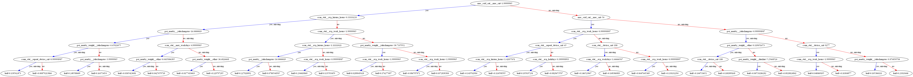

**决策树**

决策树的每个分支节点为一个特征的二分类，决策树如下图所示：

 


决策树的构建，节点的选择遵从一个原则，就是在某个节点处按照某一特征属性的不同划分构造不同的分支，其目标是让各个分裂子集尽可能地“**纯**”。尽可能“**纯**”就是尽量让一个分裂子集中待分类项属于同一类别。

判断的**纯**的方式目前有三种：

- ID3 （通过信息增益, 但信息增益偏向可分类较多的特征，分得子类越多，子类的相对纯度就相对高）

- C4.5 （通过信息增益率，来解决ID3的缺点，候选划分属性中找出信息增益高于平均水平的属性（**这样保证了大部分好的的特征**），再从中选择增益率最高的 

- CART (二叉树，仅分为两类，GINI指数,  GINI不用进行log计算，速度快。对于分类树，CART采用基尼指数最小化准则；对于回归树，CART采用平方误差最小化准则  )

  分类树  

  回归树  

  回归树建好后，我们采用的是用最终叶子节点的均值或者中位数作为预测输出结果 


**过拟合问题**

决策树算法中很容易发生“过拟合”现象，导致算法的泛化能力不强。目前，解决决策树“过拟合”现象的主要方法有两种：1.剪枝技术，2.随机森林算法。 

1. 剪枝技术分为“预剪枝”和“后剪枝”。预剪枝是指在决策树生成过程中，对每个节点在划分前先进行估计，若当前节点的划分不能带来决策树泛化能力的提升，则停止划分并将当前节点标记为叶子节点；后剪枝是先从训练集中生成一颗完整的决策树，然后自底向上地对非叶节点进行考察，若将该节点对应的子树替换为叶子节点能够带来决策树泛化能力的提升，则将该子树替换为叶子节点。 

2. Bagging和随机森林算法属于集成学习中的一种方法，可以解决决策树过拟合问题 。

   Bagging是随机选取m组有重复的大小为n的训练集，训练出m个决策树，然后按权重投票决定属于那类

   **随机森林**和Bagging类似，只是还要从d个特征中再随机选择k个特征（k=logd ），仅仅用这个k个特征来构建决策树，然后再投票 （决策树一般不能表达XOR的特征组合，可以表达AND的特征组合）


**随机森林**

随机森林简单、容易实现、计算开销小，令人惊奇的是， 它在很多现实任务中展现出强大的性能，被誉为"代表集成学习技术水平的方法"可以看出，随机森林对Bagging 只做了小改动， 但是与Bagging 中基学习器的"多样性"，仅通过样本扰动(通过对初始训练集采样)而来不同，随机森林中基学习器的多样性不仅来自样本扰动，还来自属性扰动，这就使得最终集成的泛化性能可通过个体学习器之间差异度的增加而进一步提升。


**boosting模型**

bagging和boosting都叫集成学习

 


 

**Adaboost**和**gbdt**是**boosting**树的两种， **Adaboost**是在每轮训练后，提高分类错误样本的权重

![G(x)=sign[f(x)]=sign[ \alpha_1G_1 (x)+\alpha_2 G_2 (x)+\cdot \cdot \cdot +\alpha_n G_n (x)]](https://www.zhihu.com/equation?tex=G%28x%29%3Dsign%5Bf%28x%29%5D%3Dsign%5B+%5Calpha_1G_1+%28x%29%2B%5Calpha_2+G_2+%28x%29%2B%5Ccdot+%5Ccdot+%5Ccdot+%2B%5Calpha_n+G_n+%28x%29%5D) 

			（代表个体学习器，表示该个体学习器的重要性，相当于每个分类器的票数） 

**GBDT**的核心就在于，每一棵树学的是之前所有树结论和的残差**，这个**残差就是一个加预测值后能得真实值的累加量。比如A的真实年龄是18岁，但第一棵树的预测年龄是12岁，差了6岁，即残差为6岁。那么在第二棵树里我们把A的年龄设为6岁去学习，如果第二棵树真的能把A分到6岁的叶子节点，那累加两棵树的结论就是A的真实年龄；如果第二棵树的结论是5岁，则A仍然存在1岁的残差，第三棵树里A的年龄就变成1岁，继续学。这就是Gradient Boosting在GBDT中的意义 。（GBDT是回归树而不是分类树）

参考文档：https://www.zhihu.com/search?type=content&q=%E9%9B%86%E6%88%90%E5%AD%A6%E4%B9%A0

### xgboost的 模型dump怎么解读？

```
booster[0]:
0:[mac_ssid_cnt__mac_cnt<1.99999905] yes=1,no=2,missing=2
	1:[scan_stat__avg_leisure_hours<0.33333233] yes=3,no=4,missing=3
		3:[poi_nearby__yulechangsuo<16.0000019] yes=7,no=8,missing=8
			7:[poi_nearby_weight__yulechangsuo<6.65821075] yes=15,no=16,missing=15
				15:[conn_stat__repeat_device_cnt<0.999998987] yes=31,no=32,missing=31
					31:leaf=0.139562473
					32:leaf=-0.00879213866
					...
```

booster[0] 表示第一个迭代树。如果训练设置num_round设置为10轮，且是三分类数，那么会有10*3 个booster booster[0], booster[3], booster[6]... 代表分类1

booster[1], booster[4], booster[7]... 代表分类2

booster[2], booster[5], booster[8]... 代表分类3

leaf 为 原始预测值，sigmod(prediction) = 为预测为当前分类的概率 $$ softmax(x) = \frac{e^{x_{i}}}{\sum{e^{xi}}}$$

所以说一般leaf的值越大，越说明属于该类


