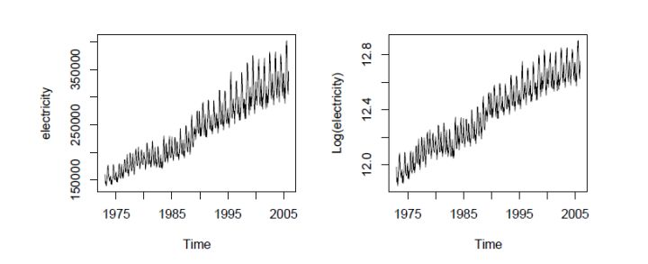

$$
\begin{matrix}
Y = f(x|\theta) + \epsilon 
\\ E(\epsilon ) = 0
\\ D(\epsilon ) = \sigma^2
\end{matrix}\
$$

$$\theta$$ 是模型参数，$$f(x|\theta)$$ 是回归函数，$$\epsilon $$为残差，x自变量，Y 因变量。

经典线性回归模型的基本假设：（1）残差具有零均值；（2）var <∞,即残差具有常数方差，且对于所有x值是有限的；（3）残差项之间在统计意义上是相互独立的；（4）残差项与变量x无关；（5）残差项服从正态分布；

回归常见的**3个必须要解决的问题**在于：

1）Heterroskedasticity异方差性： 残差的方差不为常数， 残差与x相关（eg，x变大，残差变大）， 违反了假设2和4

2）Autocorrelation自相关性：残差项之间自相关，违反了假设3

3）Multicollinearity多重共线性：多个x之间不独立，即xi与xj之间存在相关性。

问题1如下图所示，

