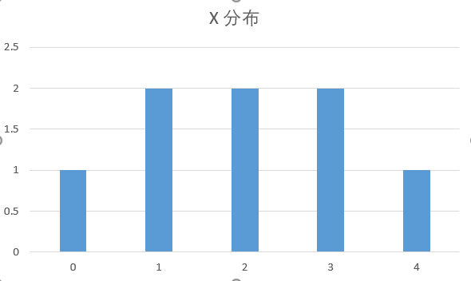
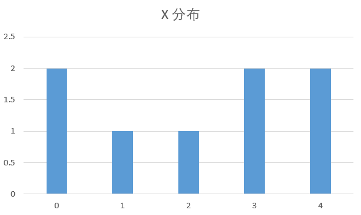

### 回归问题的损失函数

1. MSE 平方损失函数  $(y - f(x))^{2}$  （最小二乘法是满秩情况下求这个最小值的解析解）

- 解析解(analytical solution)就是一些严格的公式,给出任意的自变量就可以求出其因变量,也就是问题的解, 他人可以利用这些公式计算各自的问题. 

- 数值解(numerical solution)是采用某种计算方法,如有限元的方法, 数值逼近,插值的方法, 得到的解.别人只能利用数值计算的结果, 而不能随意给出自变量并求出计算值.自变量取值收到数值方法的一定制约。  

2. MAE 绝对损失函数 $|y - f(x)|$ 

3. Huber损失函数 
$$\left\{\begin{matrix} \frac{1}{2} [y - f(x)]^2  \ \ \ \ \ \ \ \ \ \ \ | y - f(x) | \le \delta & \\ \delta |y - f(x)| -  \frac{1}{2} \delta^2 \ \ \ \ | y - f(x) | > \delta \end{matrix}\right.​$$

比较： MSE最常用，处处可导，但缺点是会对离群点异常值太敏感，MAE相对就更加鲁棒，但是x=0处不可导不容易优化。 Huber是两者的综合，兼顾了两者的优缺点。如图：

### 分类问题的损失函数

1. 0-1 损失函数

   二分类问题，一般 $y \in \{-1, +1\}$,  $sign(f(x)) = \left\{\begin{matrix} +1 \ \ \ if\ f(x) \ge 0 & \\ -1 \ \ \ if\ f(x) < 0 & \end{matrix}\right.$

   损失函数 $$L(y, f(x)) = \left\{\begin{matrix} 0 \ \ \ if\ yf(x) \ge 0  & \\ 1 \ \ \ if\ yf(x) < 0 & \end{matrix}\right. $$

   但是这个函数，不连续，非凸， 优化困难，所以一般不直接使用

2. Logistic 损失函数 

   sigmod 函数 $$ y = \frac{1}{1 + e^{-f(x)}}$$

   $$p(y=1|x) = \frac{1}{1 + e^{-f(x)}}$$

   $$p(y = 0 |x) = 1 - \frac{1}{1 + e^{-f(x)}} = \frac{e^{-f(x)}}{1 + e^{-f(x)}} = \frac{1}{ 1 + e^{f(x)}} $$ 

   可以合并为 $p(y|x) = p(y=1|x) ^{y} * p(y=0|x) ^{1- y} = $

   极大似然法可得 $\displaystyle\prod_{i=0}^{m} p(y=1|x) ^{y} * p(y=0|x) ^{1- y}$

   对数极大似然为$\displaystyle\sum_{i=0}^{m}(ylogp(y=1|x) + (1-y) logp(y=0|x))$

   上式为 logistic loss， 二分类问题和交叉熵损失(cross entropy loss)实际上是等价的

3. Hinge loss

   $$L(y, f(x)) = max(0, 1- yf(x))$$

   它是svm的损失函数， 使得 $y f(x) > 1$ 样本损失均为0， 所以仅依靠少数支持向量就能确定分隔超平面

4. 指数损失函数

   $$L(y, f(x)) = e ^{-yf(x)}$$

   指数函数式Adaboost算法的损失函数，可以很方便的用加法模型推导出来。但是和MSE一样，对异常点很敏感。

5. Modified Huber Loss

   

   结合了hinge 和 logistic 的优点，即能在$yf(x) \ge 1$ 时产生稀疏解又能估计概率，在 $y f(x) < -1$时又能给与线性惩罚

   **全家福**

   

### 交叉熵loss

1. 怎么理解熵?

   * 熵的定义如下，在信息论中熵用于表达信息量，也就是事件的不确定程度（自信息的期望）

     $\displaystyle H(X) = - \sum_{i=0}^{m}p(x_{i})logp(x_{i}) = \sum_{i=0}^{m}p(x_{i})log\frac{1}{p(x_{i})}$ （其中m代表所有可能的类别）

     假设随机变量X 取值范围是[0,4], 产生了如下一个序列 seq = [ 0 , 1,  3,  2, 4, 2, 3, 1] 

     p(X=0) = 1/ 8    $log\frac{1}{p(x_{i})} = log8 = 3$

     p(X=1) = 1/ 4    $log\frac{1}{p(x_{i})} = log4 = 2$

     p(X=2) = 1/ 4    ..

     p(X=3) = 1/ 4     ..

     p(X=4) = 1/ 8     ..

     熵 = 2 * 0.25 + 2 * 0.25 +2 * 0.25 + 3* 0.125 + 3* 0.125 = 2.25

     但是熵为啥这么算？其实可以这样理解

     熵 = 信息量 = 最短平均编码长度

     应该都听说过哈夫曼编码，是一种不定长编码，出现次数多的用短编码，出现次数少的用长编码。由于译码所需的唯一性，任何短编码都不能是长编码的前缀。那么这个序列可以编码为：

     [00, 01, 11, 100, 101][] 

     平均比特率 = (2 * 2+  2 * 2 + 2 * 2 + 3 + 3 )/ 8 = 2.25

     所以可以看出最小编码比特数就是$log\frac{1}{p(x_{i})}$，也就是$x_{i}​$ 这一种取值的熵

     熵可以反映随机变量X 序列的分布，上述序列的分布为

     

             如果序列变成 [0,1,2,3,4], 熵 = $$\displaystyle \sum_{i=0}^ {4} \frac{1}{5} * log5 = 2.3219$$ 序列变短了，熵值反而上升了。主要是分布变掉了。当取值的可能性一致时，那么熵不同，分布肯定不同。但分布不同，熵也有可能相同。比如

2. 交叉熵怎么来的？ 为什么可以用来作为loss？

   一个随机序列X的熵是$\displaystyle H(X) = \sum_{i=0}^{m}p(x_{i})log\frac{1}{p(x_{i})}$, 我们认为p是这个随机序列的真实样本分布，q为预测分布。那么如何衡量预测分布和样本分布的一致性呢？

   用随机变量X在分布p和q上熵的差值， 即 KL散度（相对熵）， 前面一部分一定大于后面那一部分（对于同一份样本，熵是最小的编码bit数）。所以KL散度一定是一个非负值。

   $\displaystyle D_{KL}(p||q) = \sum_{i=0}^{m}p(x_{i})(log\frac{1}{q(x_{i})} - log\frac{1}{p(x_{i})}) = \sum_{i=0}^{m}p(x_{i})log\frac{1}{q(x_{i})} - \sum_{i=0}^{m}p(x_{i})log\frac{1}{p(x_{i})}$   

   最小化$D_{KL}$ 就是让预测的分布尽可能的接近样本的分布，

   前面一部分就是交叉熵 $$\displaystyle H(p,q) =  \sum_{i=0}^{m}p(x_{i})log\frac{1}{q(x_{i})}$$，后面那部分仅和样本有关, 与q分布无关。所以

   最小化交叉熵等价于最小化KL散度。

   注：TD-IDF算法就可以理解为相对熵的应用：词频在整个语料库的分布与词频在具体文档中分布之间的差异性。

3. 交叉熵和Logistic 损失函数

   当随机变量X 服从（0-1）分布时，$\displaystyle H(X) = \sum_{i=0}^{m}p(x_{i})log\frac{1}{p(x_{i})} = p(x)log\frac{1}{p(x)} + (1-p(x))log\frac{1}{1-p(x)}$ 与logistic函数是一样的

4. 交叉熵作为loss的优势

   模型训练的loss有很多，交叉熵作为loss有很多应用场景，其最大的好处我认为是可以避免梯度消散，相关的介绍参考如下链接：

   https://www.cnblogs.com/aijianiula/p/9651879.html

   https://blog.csdn.net/qikaihuting/article/details/78518263

   具体推导如下：

$$
\begin{align}
\tag{1} loss_{mse} = cost(f(x), Y) = \frac{1}{2m}\sum^{m}_{i=0}(f(x) - y)^2 \\ 
\tag{2} loss_{cross\_entorpy} = cost(f(x),Y) = \frac{1}{m}\sum^{m}_{i=0}(y_{i}*log\frac{1}{f(x)} + (1-y)log\frac{1}{1-f(x)}) \\
\\
\tag{3} f(x) = \sigma(z) = \frac{1}{1+e^{-z}} \\
\tag{4} z = wx+b \\
\tag{5} \frac{\partial l_{mse}}{\partial w} = (\frac{(f(x)-y)^2}{2})^{'} = (f(x) - y)f^{'}(x)
= (f(x) - y)\sigma^{'}(z)x \\
\tag{5} \frac{\partial l_{mse}}{\partial b} = (\frac{(f(x)-y)^2}{2})^{'} = (f(x) - y)f^{'}(x)
= (f(x) - y)\sigma^{'}(z) \\

\end{align}
$$

