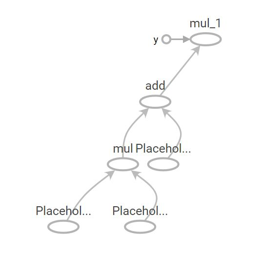

#### 基本工作流程

1. 根据需求，创建计算图Graph

2. 开启会话Session，读取数据运行Graph（

3. 获取结果

   **注**：Tensorflow先构造Graph，然后开启session在这个Graph上做运算。Graph是由一系列op组成。但凡是op，都需要通过session运行之后，才能得到结果。Session的作用就是执行Operation。

#### Tensor种类

- 常量Tensor  =  tf.constant
- 变量Tensor  =  tf.Variable  (可训练，可被优化修改)
- 占位符 placeholder （需要在训练时被feed, 为训练数据占位）
- 稀疏张量 SparseTensor （只需要填充非0值，其他值会自动填充为0）

#### Graph & GraphDef

Graph 的定义 ： “一些 Operation 和 Tensor 的集合”

对于如下代码：

```python3
a = tf.placeholder(tf.float32)
b = tf.placeholder(tf.float32)
c = tf.placeholder(tf.float32)
d = a*b+c
e = d*2
```

它的graph如下图：



Graph 是通过python来定义，但是计算不是在python中进行的，而是python会按照Protocol Buffer的格式把它训练成GraphDef。再通过 C/C++/CUDA 运行 Protocol Buffer 所定义的图。

```json
node {
  name: "Placeholder"     # 注释：这是一个叫做 "Placeholder" 的node
  op: "Placeholder"
  attr {
    key: "dtype"
    value {
      type: DT_FLOAT
    }
  }
  attr {
    key: "shape"
    value {
      shape {
        unknown_rank: true
      }
    }
  }
}
node {
  name: "Placeholder_1"     # 注释：这是一个叫做 "Placeholder_1" 的node
  op: "Placeholder"
  attr {
    key: "dtype"
    value {
      type: DT_FLOAT
    }
  }
  attr {
    key: "shape"
    value {
      shape {
        unknown_rank: true
      }
    }
  }
}
node {
  name: "mul"                 # 注释：一个 Mul（乘法）操作
  op: "Mul"
  input: "Placeholder"        # 使用上面的node（即Placeholder和Placeholder_1）
  input: "Placeholder_1"      # 作为这个Node的输入
  attr {
    key: "T"
    value {
      type: DT_FLOAT
    }
  }
}
```

#### OP

是tensorflow的计算单位（是计算的一种抽象），用OpDef元信息来定义，包括OP的名字，输入输出列表，属性列表，优化选项。


#### 计算tensor的调用方式

```python
#方式1:
#其中loss是要求解的tensor， feed_dict是用来填充上游占位的tensor
tf.Session.run(loss, feed_dict={placeholder_x:[...]})

#方式2:
sess = tf.Session()
with sess.as_default():
    loss.eval()
    
#区别：你可以使用sess.run()在同一步获取多个tensor中的值,如:
tf.Session.run([loss, acc], feed_dict={placeholder_x:[...]})
```

#### tf.Data与Dataset

参考[tf.Data](https://blog.csdn.net/feixiang7701/article/details/81611356)

#### 训练数据流水加载

[优化参考文档](https://www.tensorflow.org/guide/performance/datasets?hl=zh-cn)

训练时数据的加载分为三步：

1. **提取**：从永久性存储（可以是 HDD 或 SSD 等本地存储或 [GCS](https://cloud.google.com/storage/?hl=zh-cn) 或 [HDFS](https://en.wikipedia.org/wiki/Apache_Hadoop#Hadoop_distributed_file_system) 等远程存储）读取数据。

2. **转换**：使用 CPU 核心解析数据并对其执行预处理操作，例如图像解压缩、数据增强转换（例如随机裁剪、翻转和颜色失真）、重排和批处理。

3. **加载**：将转换后的数据加载到执行机器学习模型的加速器设备（例如，GPU 或 TPU）上。

   ```python
   #1. 基础版
   def input_fn():
     files = tf.data.Dataset.list_files("/path/to/dataset/train-*.tfrecord")
     dataset = files.interleave(tf.data.TFRecordDataset)
     dataset = dataset.shuffle(buffer_size=FLAGS.shuffle_buffer_size)
     dataset = dataset.map(map_func=parse_fn) #这一步是单线程，可能跟不上GPU的速度
     dataset = dataset.batch(batch_size=FLAGS.batch_size)
     return dataset
   #解释：当 CPU 正在准备数据时，加速器GPU处于空闲状态。相反，当加速器正在训练模型时，CPU 处于空闲状态。因此，训练步的用时是 CPU 预处理时间和加速器训练时间的总和
   
   #2.[流水线|并行|分布式存贮]优化版
   def input_fn():
     dataset = files.apply(tf.contrib.data.parallel_interleave(
       tf.data.TFRecordDataset, cycle_length=2)) #hdfs读取友好
     dataset = dataset.repeat(FLAGS.epoch_num)
     dataset = dataset.shuffle(buffer_size=FLAGS.buffer_size)
     dataset = dataset.apply(tf.data.experimental.map_and_batch(
          map_func=parse_fn, batch_size=FLAGS.batch_size, num_parallel_batches=8))#并行
     dataset = dataset.prefetch(buffer_size=FLAGS.buffer_size) #流水线预加载
     return dataset
   ```

#### 动态图 & 静态图

tensorflow 是静态图，而pytorch是动态图。 静态图就是在模型全部定义完以后再决定如何进行求导如何进行数值计算，模型定义的代码段是无法通过调试实时查看具体tensor中的值的，如果必须要查看则需要`sess.run([tensor_check])`，或者通过以下api (tf.print/tf.assert/tf.py_func/tf_debug)，这种方式方便进行计算的优化，但是对开发调试不友好。

相对来说，动态图就是可以运行时调试查看，对开发调试更加友好。

#### 如何利用Tensorboard

作为tensorflow超越pytorch的一方面，Tensorboard的利用很重要。

刚开始训练时，权重分布w应该是相似的。随着训练过程的推进，各层网络的学习重点出现差异化，权重分布也应变化，差异化可以表现在方差增大，每层学习到的信息量增加