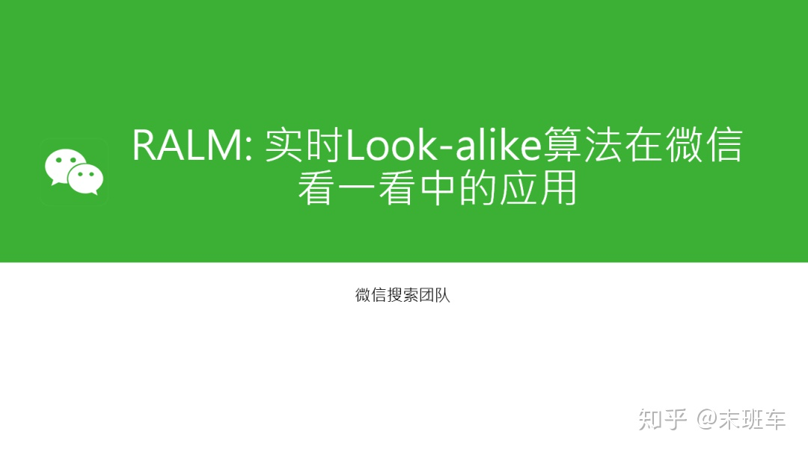

**导读：**本次分享是微信看一看团队在 KDD2019 上发表的一篇论文。长尾问题是推荐系统中的经典问题，但现今流行的点击率预估方法无法从根本上解决这个问题。文章在 look-alike 方法基础上，针对微信看一看的应用场景设计了一套实时 look-alike 框架，在解决长尾问题的同时也满足了资讯推荐的高时效性要求。

**▌背景**

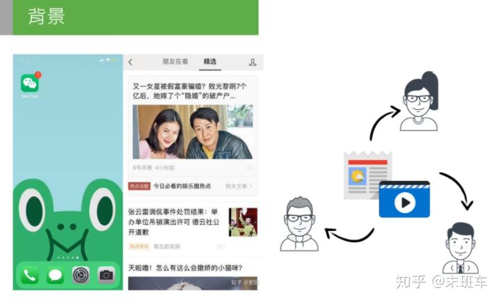

微信大家可能都用过，微信中的“看一看”是 feed 推荐流的形式，涵盖了腾讯整个生态链的内容分发平台，包括腾讯新闻、公众号文章、腾讯视频等。每天总分发量在千万级以上，面对如此大的分发量，要满足不同兴趣偏好的用户需求，使用传统的方法时遇到了一些问题。我们针对发现的问题做了优化和改进，接下来分享下我们优化的过程。

**▌未缓解的马太效应**

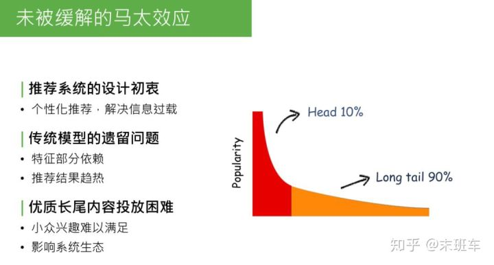

马太效应，简单解释，在内容的生态系统中，自然分发状态会造成一种现象：头部10%的内容占据了系统90%的流量、曝光量or点击量，剩下90%的内容，集中在长尾的10%里。这对于内容的生产方、内容系统的生态和使用系统的用户来说，都是不健康的状态。造成这种现象的原因，是因为系统分发能力不够强，无法处理信息过载的现象，推荐系统设计的初衷就是为了解决马太效应问题。

回顾推荐系统的发展，从最开始的规则匹配 -> 协同过滤 -> 线性模型 -> deep learning，逐步缓解了马太效应现象，但没有完全解决。

造成这个现象的原因是传统模型、CTR 预估和 deep model，都对部分特征有依赖，没有把特征完全发掘出来，导致模型推荐结果是趋热的，使生态系统内优质长尾内容投放依然困难。因为 CTR model 最终趋向于行为特征，或者后验结果较好的数据，对于优质长尾内容，如小众兴趣的音乐、电影、深度报道的新闻专题等，获得的相应曝光依旧困难，处于马太效应 long tail 90%的部分，这会影响推荐系统的生态，导致推荐系统内容越来越窄。

**▌为什么无法准确投放长尾？**

怎样解决这个问题？这个问题归根结底是对内容的建模不够完整。我们尝试分析下问题出在哪：

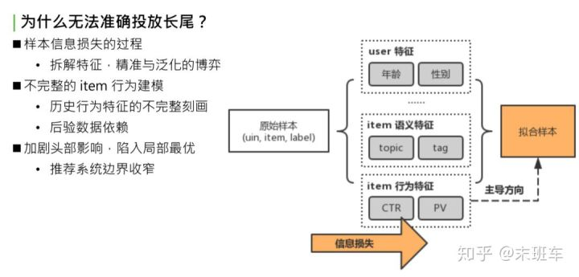

先看下推荐系统建模流程。首先得到原始样本，这是业务下的训练数据，形式是三元组：userid，itemid 和 label。如果是 timeline 的样本，那就是点击或者不点击。原始样本中，一条样本可以完整表示一个用户在某个时间点对一个 item 产生了一次行为，把这个三元组当作信息的最完整形式。对于这个完整形式，直接建模很简单，如传统的 item CF，或者协同过滤。协同过滤是最初级的方法，直接对 uid，itemid，label 做拟合，因为可以完全利用初始样本的信息，拟合的准确性非常好。弱点也很明显，对原始样本中没有包含的 userid 或者 itemid，没有泛化推理能力，后续新曝光的 user 和 item 是无法处理的。这个问题，就是我们要做的第二步骤，对原始样本做抽象。既然无法获取所有的 userid 和 itemid，那就要对 user 或者 item 做一层抽象，如 user 抽象成基础画像：年龄、性别或所处地域；item 抽象成语义特征：topic、tag 等；item 历史行为特征，简单做统计：过去一段时间的点击率、曝光率、曝光次数。最后基于泛化过的特征做拟合，得到最终模型。

问题出在哪？做原始特征抽象，抽象意味着发生了信息损失，这部分信息损失导致模型拟合时走向了比较偏的道路。举个简单的例子：同一个 item，有相同的 topic tag，历史点击率和历史曝光次数和点击次数也相同，可以说这两个 item 是相同的吗？显然有可能是不同的。使用统计特征无法完整表达，同样的 item 点击都是0.5，PV 都是1000 or 2000。有些 item 被这群用户看过，有些 item 被那群用户看过。尽管语义特征和行为特征都相同，但两群 user 不同，Item 的受众也不同。这里说的抽象的方式，是不完整的 item 行为建模，也是对 item 历史行为不完整的刻画，这就导致了整个 model，对 item 后验数据十分依赖，导致推荐结果趋向于 CTR 表现好或者 PV 表现好的 item。最终后验数据表现好的数据又会更进一步被模型推荐且曝光，这样会造成恶性循环：一方面，加剧了头部效应的影响，使模型陷入局部最优；另一方面，整个推荐系统边界效应收窄，用户趋向于看之前表现好的数据，很少看到能拓宽推荐系统边界或者用户视野的长尾数据。

**▌Look-alike 模型**

问题就是这样产生的， 可以思考一下，问题的本质是什么？就是因为模型无法对 item 行为完整建模，这一步信息损失太大，怎么解决这个问题呢？我们首先想到了一种方案：look-alike。

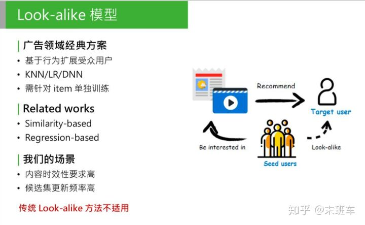

这是广告领域的经典方案，这类模型的方法也很简单，首先可以有一个候选集合的 item，我们要推这部分 item，怎么推呢？第一个步骤：找到历史上已知的、广告主提供的对 item 表达过兴趣的用户，这部分用户称为种子用户。然后使用用户相似度法方法，找到和种子用户最相似的目标人群，称为目标用户，把这部分 item 直接推给目标用户。这个方法在广告系统中，是用来做定向投放的，效果很好。为什么呢？我们来看下模型的整体思路。

把相关的 item 找到对它发生过历史行为的种子用户，直接用种子用户的特征，作为模型的输入，这是正样本；从全局用户中负采样一部分用户作为负样本。用历史行为的用户的特征来学习 item 的历史行为，相当于把不同用户看过的 item 区分开，其实是对 item 的历史行为特征的完整建模。之前提到，行为样本是信息量最大的样本，它们没有经过抽象，如果能完整的用受众用户的行为来计算 item 的特征，可以说是最完整的 item 历史特征的建模。

Look-alike 在广告领域的应用已经很完善，也有很多方式。可以把 look-alike 相关的研究分成两个方向：第一种是基于相似度的 look-alike，这种 look-alike 比较简单，大体思路是把所有用户做 user embedding，映射到低维的向量中，对它做基于 k-means 或者局部敏感 hash 做聚类，根据当前用户属于哪个聚类，把这个种子用户的类感兴趣的内容推给目标用户。这种方法的特点：性能强。因为简单，只需要找簇中心，或者向量相似度的计算，因为简单、性能好，模型准确性低。

第二种是和第一种相反的，基于回归。包括 LR，或者树模型，或者 DNN or deep model 的方法，主要思路是直接建模种子用户的特征。把种子用户当做模型的正样本， 针对每个 item 训练一个回归模型，做二分类，得出种子用户的特征规律。这种方法的优点是：准确性高，因为会针对每个 item 建模。缺点也明显：训练开销大，针对每个 item 都要单独训练一个模型。对于广告来说，可以接受，因为广告的候选集没有那么大，更新频率也没那么高。

但是对于我们的推荐场景，有一些问题：1. 对内容时效性要求高，如推荐的新闻专题，必须在5分钟或10分钟内要触达用户；2. 候选集更新频率高，我们每天的候选集上千万，每分钟、每一秒都有新内容，如果新内容无法进入推荐池，会影响推荐效果。

**▌核心需求**

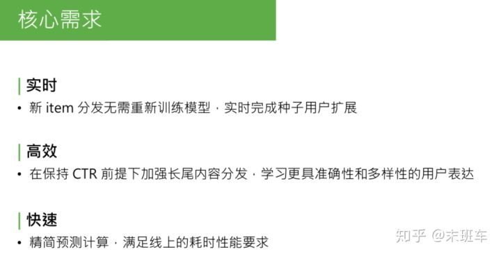

在我们的场景下，如果还用广告领域的经典的 look-alike，是无法解决的。如果要对每个候选集建模，采用 regression-base 的方法，如每分钟都要对新加进来的候选集做建模，包括积累种子用户、做负采样、训练，等模型收敛后离线预测 target user 的相似分，这对于线上的时效性是不能接受的。

对于 similarity base 的方法，它的问题是计算过于简单，如果直接和 CTR 模型 PK，核心指标会下降，得出来的结论是：传统的 look-alike 不能直接照搬到我们的系统中。

**针对我们的需求，我们整理出来了应该满足的3点核心需求：**

**1. 实时。新 item 分发不需要重新训练模型，要能实时完成种子用户的扩展；**

**2. 高效。因为线上加到 rank 模型 CTR 的后面， 要保持模型核心指标 CTR 的前提下，再去加强长尾内容分发，这样模型才有意义。要学习准确性和多样性的用户表达方式。**

**3. 快速。Look-alike 模型要部署到线上，实时预测种子用户和目标用户群体的相似度，要满足线上实时计算的耗时性能要求，也要精简模型预测的计算次数。**

**▌RALM：Real-time Attention based Look-alike Model**

基于这三个核心需求，我们提出了一个新的方法，全称是 real-time attention based look-alike model，简称 RALM。我先简单讲下 RALM 核心的三个点。

**1. 核心点**

① 模型可总结为 user-users 的 model。回想下经典的 CTR 预估模型，是 user2item 的 point-wise 的处理流程建模。User、item、label，我们做的最大的变化，是借鉴了 look-alike 的思想，把 item 替换成种子用户。用种子用户的用户特征，代替 item 的行为特征。所以模型从 user2item 的 model，变成 user2user 的 model。图中右侧是 target user，左侧是 seeds。

② 完善的 seeds representation。用种子用户代替 item 行为特征。这样面临的问题是：怎样更好地表达一个人群。这个 seeds representation，是我们研究中的核心步骤，要得到一个高效、自适应更新的种子用户的表达方式。

③ real-time。最终目标是部署在线上，实时预测种子用户群体相似度，需要是能够实现 real-time 的框架。

上述是模型表达的思路。I 是一个 item，把 item 用 seeds 的 embedding 的集合来表示，seeds embedding，是组成这个种子用户的每个用户的 embedding 的函数。学习了 seeds representation，就是这个函数 f。

**2. 整体结构**

接下来看下离线训练部分，这是离线训练的整体结构。

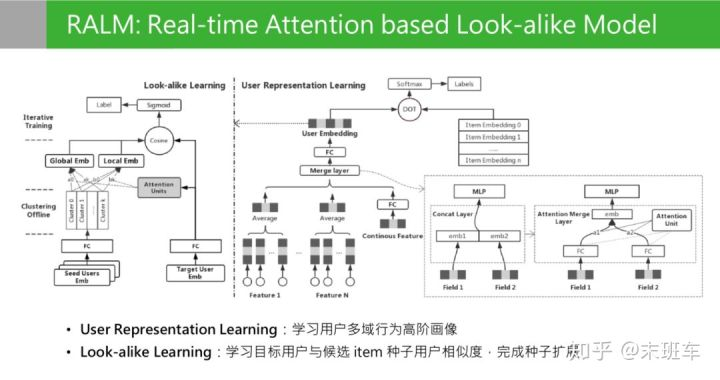

模型离线训练分成两个阶段：右侧 user representation learning， 左侧第二阶段是 look alike learning。user representation learning 模型结构，最后的目标是通过一个用户在不同领域的行为，学习到用户在所有领域的多样性且兼顾准确性的用户兴趣的高阶画像。这个画像在这个位置是低维特征，向量特征通过 user presentation learning 的目标学到了所有用户的 embedding 之后，第二阶段是 look alike learning。Look alike learning 模型，是一个 user to user 的 model，右侧是目标用户的特征输入，左侧是种子用户人群的 embedding 输入，左边种子用户是一群用户的 embedding 堆叠到一起，输入其实是一个矩阵。这两边的输入来源都是第一阶段 representation learning 输出的 embedding。Look alike 的目标是学习目标用户和候选 item 种子用户的相似度，最上面是学习两次相似分的，最后完成种子用户的扩展。

**▌User Representation Learning**

按顺序来分析下，第一阶段，是用户的表示学习，user representation learning。

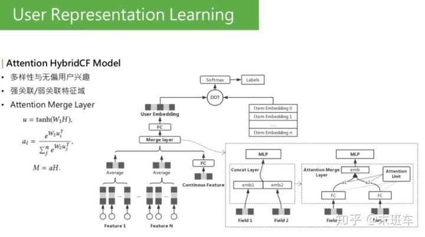

这个模型大家看着会比较眼熟，它是用 Youtube 的 representation model 中演化过来的。Youbute 的基础模型很简单，下面是用户在不同领域的行为，下面的基础特征可能会有离散值，也可能是连续值。如果是离散值，可以通过 embedding lookup，再过一个 pooling，再和所有领域的特征做 merge，上面过一个全连接，最后输出 embedding。右侧是感兴趣的 item，也会做一些 embedding lookup，整个做 sce loss，或者是多分类。要预测的是：用户在点击了这么多 item 之后，下一个要点击的 item，最后要预测的就是表达用户兴趣的 embedding。这层 merge layer，最初 Youtube 的版本是用一个 concat。可以看到最初版模型在训练时遇到了一个问题，最下层是用到了用户很多个域 ( 每个 field 称为一个域，可能是每个用户在每个分布下的行为，如电商购物下行为，或者是公众号阅读的行为 )。

训练时看到一个现象，有些域的行为学的非常强，参数来看学的非常充分，某些 field 参数分布不大，最后的权重值较小，对最终预估的分数没有影响。这里有两个名词：强关联和弱关联。最终预估结果关系比较大的 field、参数学习较强的，称为强关联特征域；相反，学的不充分的、对最终结果影响小的，称为弱关联特征域。对于强关联和弱关联，如果看到参数分布是这样的，是不是就表明弱关联特征不重要呢？并不是。举例来说，representation learning 如果训练目标是在“看一看”中的阅读行为，对于某些经常使用微信公众号、或者阅读的用户来说，他们在公众号平台的阅读历史就是非常强的关联特征，能够决定再看一看中的兴趣。对于这些特征来说，这些特征是很强的，对于其他的如在电商中的购物或者是在搜索中的 query，这些是比较弱的，对看一看的影响很有限。再思考另一种 case，比如，看一看通过某种形式，吸引了很多新用户。新用户进来之后，没有在公众号平台的阅读历史，但是他们在购物或者搜索中有历史行为，此时这些历史行为会影响他下一次阅读的文章，或者感兴趣的 item。这些特征对这些用户来说是非常重要的。但目前，显然这些用户是没有学到这些变化的。

排查了下模型训练的过程，可以把结果集中在这一点上，就是这个 merge layer，其实是负责把用户不同域的特征 merge 到一起。Merge layer，可以看到右侧的图，原始的 deep model 用的是左侧的实现方法，直接用 concat。Concat 的优点是，可以学到所有 field 的参数，缺点是，无法根据输入的不同分布，来调整权重值。也就是说，如果80%的用户的阅读历史都是看一看的种子用户，阅读历史都是很丰富的，就很有可能对所有用户都把这个特征学的很强。如果是少量用户，就学不到了，少量用户关注对其它特征的启发作用，concat layer 是学不到的。因为它对于大部分用户来说，已经把参数学的非常重了，小部分用户不足以对它产生影响。所以需要一个机制，针对不同用户的特征域的输入动态调整 merge layer 的方式，我们想到的最好的办法是 attention。Attention 是最近在 NLP 中非常火的，很多模型都会用到。为什么要用 attetnion？

右下角的结构，就是 attention。我们用到的 attention 是把用户的输入的所有的域当做 attention 的 query，key 和 value 都是自身 field 的本身。这是一个典型的 self-attetnion，我们最后要做的是，让模型根据用户自己的输入领域的情况，动态调整不同领域的融合方式，相对于之前的 concat 的方式来说，concat 其实是把所有领域的 field 强行放在同一个向量空间中来学习，自然会有学习不充分的情况。Self-attenion merge 是让不同的域在自己的向量空间中学习充分，再通过不同的权重组合在一起。其实是相当于让用户能有属于自己的表达，而不是被历史丰富的用户带着走。这是一个优化，可以明显改善强弱特征、训练不均衡的问题。

可以看一下这是我之前训练的时候在某个特征域用 tensorboard 打出来的参数分布的情况，可以看到 attention merge layer 前后，训练参数有很大变化，之前这些参数基本上都是0，之后会激活出一些值，这个是最后 user presentat learning 的值：precession、recall、auc。也可以看到模型加完 attention 之后，在 auc 和 loss 上都有所优化。

经过 user representation learning 之后，我们现在拥有了所有用户的兼顾多样性和准确性的 embedding 表达。接下来要做的是怎么用 embedding 来表达种子用户人群？

**▌Look-alike learning**

Look-alike 要做的第一步就是如何表达 seeds user。

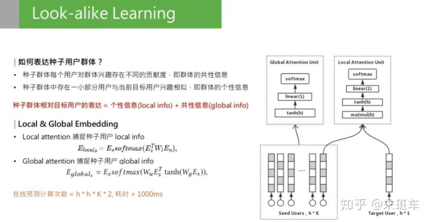

一个种子用户应该包含什么信息，这里我们做两点假设：

\1. 每个用户都有自己的兴趣，但对整个群体的人群信息存在不同的贡献度，我们称为群体的共性信息：global info。共性信息和目标用户无关，只和用户群体自身有关。

\2. 种子用户群体的个性信息。种子群体中一定存在一小部分用户和 target 用户兴趣相似，这时，当 target 人群变化时，信息会变化，称为 local info。

种子用户的相对表达=个性信息+共性信息。怎样学习 local info 和 global info 呢？我们想到的是用不同的 attention 机制，学习出两个 embedding：local & global embedding，分别表示这两种信息。对于 local embedding，是右上角的图，称为 local attention unit，这个 attention，是一个乘法开始，它的公式是把种子用户的矩阵乘以 w，再乘以 target user 的 embedding，再做一层 softmax，再乘以种子用户自己，这是一个典型的乘法 attention。它的作用是提取种子用户群体中和 target user 相关的部分。捕获种子用户的 local info。

第二部分是 global info，用 global attention，只和 user 相关，和 attention merge 的方法类似，也是一个 self-attention。作用是把种子用户乘以矩阵转换，再乘以种子用户自己，所做的就是捕捉用户群体自身内部的兴趣分布。得到的这两种 local & global embedding 之后，进行加权和，这就是种子用户群体的全部信息。另一个问题来了，采用两种 attention union 来捕获信息，这意味着要计算很多次矩阵乘法，对线上开销很大。两个 embedding 需要多少次计算？这里有个表达公式，这个 h 是 embedding 的维度，K 是种子用户用户的数量，总的计算次数 = h * h * K * 2。对于线上耗时，一次预测超过 1000ms，无法接受。

优化耗时，第一个方法是减少种子用户的数量，这样会影响种子用户的表达完整性；另一种是我们线上采取的方式，使用聚类。找到种子用户内部比较相似的，把它们聚在一起。这种方法：1. 减少 key 的数量，2. 保持种子用户的全部信息。聚类的方式比较简单，用的是 k-means。

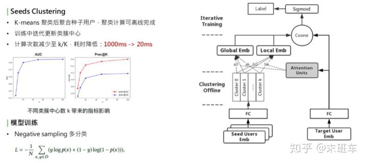

简单看下这个模型，右侧是 target user embedding，经过全连接，左边是 series user embedding 矩阵，两边都经过 embedding 之后，首先对种子用户的 embedding 做聚类，得到 k 个聚类中心，把种子用户的向量根据 k 个聚类中心做聚和，在类似中心内部做类似于 average 的聚和，然后得到 k 个向量，在这 k 个向量之上，一边做 global embedding，另一边和 target user 做 local embedding。有了这两个 embedding 之后，通过加权和的方式，做 cosine，再去拟合 user 到 item 的 label。这里的 label 用的是点击。

**细节：**

聚类的过程需要迭代，比较耗时，并非每个 batch 都去更新聚类中心，而是采取迭代更新的方式，比如把1000个 batch 一轮，训练完1000个 batch 之后，这1000个 batch 中，不更新聚类中心；到了第二轮，根据全连接参数的变化，再去更新种子用户的聚类中心，每通过一轮更新一次聚类中心，保证和核心参数是同步的。这样既保证了训练的效率，也保证了训练的准确性。聚类的优化，使线上的计算次数减小到了 k/K 中，之前 K 是万级别的数量，现在 k 是百级别的数量，耗时也下降了很多。

根据实验结果，确定不同聚类中心数 k 带来的影响，选择了合适的 k。实验中，k=20，线上 k 是100左右。模型训练的 label 优化方式，是一个多分类。对不同的种子用户人群选择最相似的用户。多分类的优化方式和 deep model 相似，采用 negative sampling 的方式。

**▌系统架构**

线上需要实现实时预测，系统实际部署到线上，需要整套系统架构。简单介绍下 RALM 的配套体系。

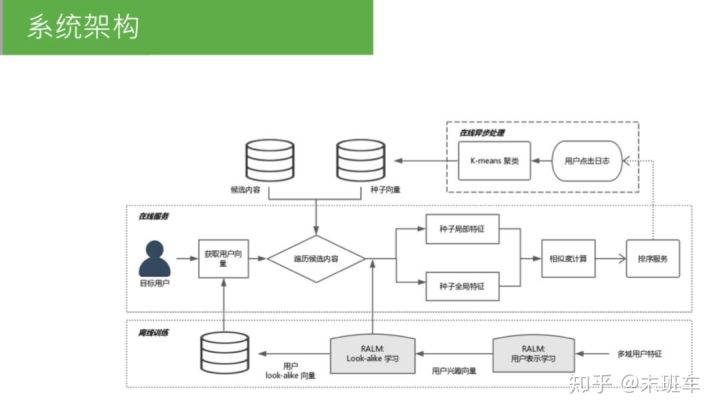

大体过程，分成三个模块，从最底下的离线训练，到在线异步处理，到在线服务，接下来分别讲一下。

**1. 离线训练**

离线训练，就是两个阶段的训练，representation learning，look alike learning，需要一提的是，进行完 look alike learning 之后，可以把 user 经过全连接层的 user 表达缓存起来。全量用户，有10多亿，可以 catch 到 KV 中。可以提供给在线服务做缓存，线上不用做实时全量传播。

**2. 在线异步处理**

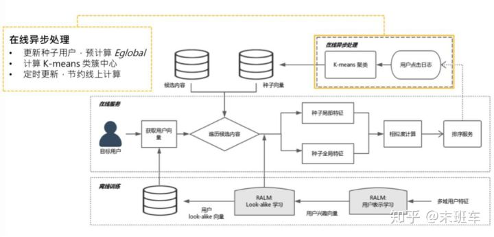

离线训练结束后，是在线异步处理，主要作用是某些可以离线且和线上请求无关的计算，可以先计算完，如更新种子用户。每个 item 候选集都会对应一个种子用户列表，更新种子用户列表，可以每一分钟更新一次，这和访问用户无关，只和候选集的 item 有关。可以实时拉取用户的点击日志，更新点击某个候选集的种子列表。

1.可以把 global embedding 预计算 ( gl 只和种子用户有关，是 self-attenion，可在线做异步处理，如每隔一分钟算一次 ）。

\2. 计算 k-means 聚类中心，也是只和种子用户有关，可以提前计算好，如推到推荐系统内存中。

\3. 所有的东西都是定时更新，不需要线上实时计算。

**3. 在线服务**

线上把聚类中心、global embedding 和所有用户的 embedding 都已缓存好，只需要拉取 user embedding，和候选集的 global embedding 和聚类中心。线上只需要计算 local embedding，是 target user 到种子用户的 attention，这需要根据线上请求的 urn 来实时计算。再计算一次 cosine，就可以得到相似度，这个计算量很小。

**▌实验结果**

算出 look alike 相似度之后，相似度的分数，可直接给到排序服务，做曝光依据。这是当时写论文之前做的 ABtest，对比的是用户画像匹配推送的策略，上线之后，在扩大曝光规模的前提下，CTR 基本取向稳定，而且有微小提升，多样性也提升了很多，这都是相对提升。

**▌一些细节和思考**

**特征：**

为什么要用第一阶段的 user representation learning 得到用户的高阶画像？高阶画像的作用：包含了用户在某个领域的全部信息，信息量很大，结合 look alike learning 中的行为，需要去学习用户群体的特征。不用高阶特征，怎样学习用户群体？比较简单的方法是通过统计的方式：平均年龄分布和平均阅读倾向。这些都是基于离散的统计，信息损失很大。如果有了高阶的特征，高阶特征也是从低阶特征，如基础画像、年月分布，这些都是可以学到高阶特征中。如果能够直接输出所有领域的高阶特征，之后的利用、或者作为召回、作为 CTR 特征，都很方便。

**模型调优：**

① 防止模型过拟合。look alike 的结构很简单，这样做的原因: 直接使用用户的高阶特征，使用了用户特征，如果模型不做处理，容易对高阶特征过拟合。采取了2种方式：

\1. 尽量保证 look alike learning 结构简单；

\2. 全连接层做 dropout。

② 采用 stacking model 的形式。看一看阅读、电商、新闻、音乐领域都做一次 user representation learning，这些特征用 stacking 的模式都放到 look alike model 中学习，这就是不同特征根据不同目标来训练的，更加减少了在同一个模型中过拟合的防线。

**冷启动曝光：**

Look alike model 中用了种子用户的表达，如果线上有新的 item，怎样做曝光？

\1. 初始投放策略。使用基于 user item 的语义特征做线性模型的预测，当做冷启动 item 的初始投放。这个初始投放不需要积累很多种子用户，大概到百级别的种子用户就可以切到 look alike 逻辑了。

\2. Look alike 出来的相似度分数，怎么做曝光的依据？如果直接用相似度分数，需要确定曝光阈值，如对于某个 item，高于多少分才曝光。我们使用的是线上试探曝光机制：最初给1000条流量，做曝光，这次曝光后，收集在用户侧的打分，取打分的分布统计，根据不同业务的要求，曝光 top 5% 或者 top10%， 来砍一个阈值分数，最后取曝光阈值。

本次分享就到这里，谢谢大家。

**▌Q & A**

Q：这个算法有没有在召回环节用，曝光该如何理解？

A：目前的策略有两种方式：

\1. 直接采用召回的方式，定一个曝光阈值，直接确定是否曝光；

\2. 把相似分数给到下游的 CTR model 作为参考。

Q：能否将两阶段学习合并成一个端到端学习？

A：End-to-End 方式存在两个问题：

\1. 整个模型参数量很大，结构比较复杂，采用 End-to-End 方式不一定能学习到或者学习的很充分；

\2. 刚刚讲到的 stacking 方式，我们最后需要的是尽可能全的表达用户的方式，所以右侧的 user representation learning 并不是从单一业务领域得出的结果，有可能是在多个领域得到的结果，比如在看一看训练一版 user representation learning，然后用社交或者电商上的行为，再做一版用户的表示，最后用 stacking 的方式把它们拼接起来，作为特征输入，这样达到的效果会更好。

Q：如果将第一阶段用户表征学习换成其他通用能学习表征用户向量的模型，效果会有什么影响？

A：我们单独用 user representation learning 和其它模型做过对比，比如 CTR 中的 user embedding，是针对当前业务比较精准化的表达，所在在泛化性上没有 user representation learning 效果好。

**▌参考资料**

Real-time Attention Based Look-alike Model for Recommender System

[https://arxiv.org/abs/1906.05022](https://link.zhihu.com/?target=https%3A//arxiv.org/abs/1906.05022)

发布于 01-16