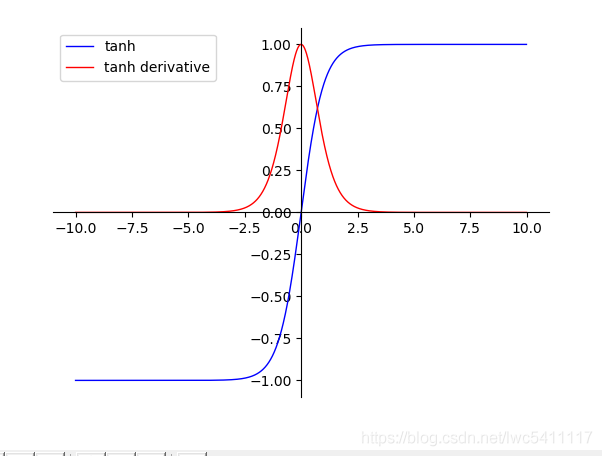

先用Batch Normalization 再用激活函数

```
net = tf.layers.dense(input, units=unit, activation=None, kernel_initializer=tf.truncated_normal_initializer())
net = tf.nn.relu(tf.layers.batch_normalization(net, training=(mode == tf.estimator.ModeKeys.TRAIN)))
```


[Ordering of batch normalization and dropout in TensorFlow?](http://stackoverflow.com/questions/39691902/ordering-of-batch-normalization-and-dropout-in-tensorflow)

在 [Batch Normalization: Accelerating Deep Network Training by Reducing Internal Covariate Shift](https://arxiv.org/pdf/1502.03167.pdf) 一文中，作者指出，“we would like to ensure that for any parameter values, the network always produces activations with the desired distribution”（produces activations with the desired distribution，为激活层提供期望的分布）。

因此 Batch Normalization 层恰恰插入在 Conv 层或全连接层之后，而在 ReLU等激活层之前。而对于 dropout 则应当置于 activation layer 之后。

-> CONV/FC -> BatchNorm -> ReLu(or other activation) -> Dropout -> CONV/FC ->；


一般来说，BN和dropout没必要一起用，BN有不弱于dropout的正则化效果


#### 激活层的作用：

*Answer*：提供非线性的能力，否则就是对原始特征的一个线性变化

#### 梯度消失与梯度爆炸的原因：


*Answer*：

sigmoid函数


tanh函数



当每一层的线性变化$$Z_i$$ 过大时，会使得 $sigmoid (Z_i)$ 或者 $tanh(Z_i)$ 的导数趋近于0，使得梯度无法更新

relu函数：


relu的梯度比较稳定，可以有效缓解梯度爆炸和消失的问题

梯度消失：$$s'\;(Z_n)$$ 较小导致连乘导致梯度过小

梯度爆炸：$W_n$ 过大，连乘导致梯度太大，但是一般$W$合理初始化，不太会出现这个问题

#### 神经网络的反向传播：

假设网络有三层：

$Z_1 = W_1 * X$

$a_1 = s(Z_1)$

$Z_2 = W_2 * a_1$

$a_2 = s(Z_2)$

$Z_3 = W_3 * a_2$

$a_3 = s(Z_3)$

根据链式法则：

$$\displaystyle \frac{\varphi Loss}{\varphi W_1}\;=\;\frac{\varphi Loss}{\varphi(a_3)} * \frac{\varphi a_3}{\varphi(Z_3)}\; * \frac{\varphi Z_3}{\varphi(a_2)}\; * \frac{\varphi a_2}{\varphi(Z_2)}\;* \frac{\varphi Z_2}{\varphi(a_1)}\;* \frac{\varphi a_1}{\varphi(Z_1)}\;* \frac{\varphi Z_1}{\varphi(W_1)}\;$$

$$ = \frac{\varphi Loss}{\varphi(a_3)} * s'\;(Z_3) * W_3 * s'\;(Z_2) * W_2 * s'\;(Z_1) * W_1 * X$$

梯度消失问题发生时，接近于输出层的hidden layer 3等的权值更新相对正常，但前面的hidden layer 1的权值更新会变得很慢，导致前面的层权值几乎不变，仍接近于初始化的权值，这就导致hidden layer 1相当于只是一个映射层，对所有的输入做了一个同一映射，这是此深层网络的学习就等价于只有后几层的浅层网络的学习了。

其实梯度爆炸和梯度消失问题都是因为网络太深，网络权值更新不稳定造成的，本质上是因为梯度反向传播中的连乘效应。对于更普遍的梯度消失问题，可以考虑用ReLU激活函数取代sigmoid激活函数。

#### 为什么需要Batch Normalization？

白化：让每个特征的分布都是均值为0，方差为1

BN:  简化+改进版的白化， 首先由于full batch内存要求太高，所以在mini batch内做，其次 白化会导致降低输入数据的表达力，所以BN再加上也给线性变换

每一层的线性变换为：$$Z^{[l])} = W^{[l]} * X + b^{[l]}$$

非线性变换为： $$A^{[l]} =  g^{[l]}(Z^{[l]})$$

首先通过BN，让每次$Z^{[l]}$变化到一个标准分布，避免它进入一个梯度饱和区, 可以加速模型学习速度

其次BN使得网络中的参数不那么敏感，使得网络学习更加稳定（比如learning rate过高出现震荡和不收敛的情况）

再次上次BN允许使用饱和性激活函数，它可以缓解梯度消失的问题

最后BN有一定的正则化效果，$Z$ 会减小为$\hat{Z_j}$ ，过大导致的过拟合不再有很大影响

$\displaystyle \mu_{j} = \frac{1}{m}\sum_{i=1}^{m}Z_j^{(i)}$

$\displaystyle \sigma^{2}_{j} = \frac{1}{m}\sum_{i=1}^{m}(Z_j^{(i)} - \mu_{j})^2$

$$\displaystyle \hat{Z_j} = \frac{Z_j - \mu_j}{\sqrt{\sigma^{2}_{j}  + \varepsilon}}$$

另外加上的线性变化添加了两个学习的参数 $\gamma$, $\beta$ 

使得 $$\displaystyle \hat{Z_j} =  \gamma \frac{Z_j - \mu_j}{\sqrt{\sigma^{2}_{j}  + \varepsilon}} + \beta$$

当预测时，BN由于只有一条数据，$\mu$ 和 $\sigma$ 一定是有偏估计。 所以在预测截断，要利用train阶段保存下来的 $\mu$ 和 $\sigma$ .