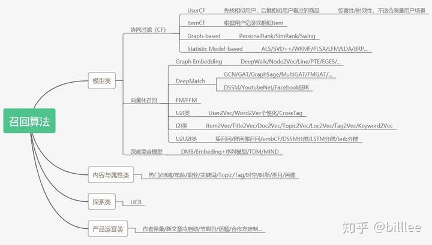
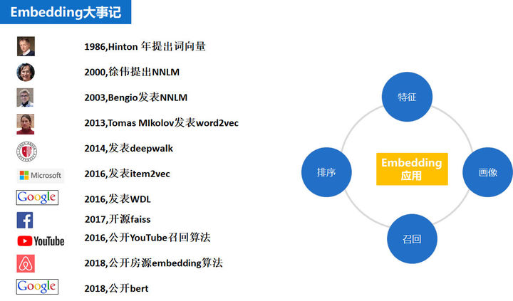

推荐问题的简化：

业务目标： CTR + 时长

排序部分： MMOE 样本融合 CTR 和 时长

召回部分： 建立用户兴趣建模 （建立用户和兴趣的连接）

一方面用户的兴趣是发散的多元的，如何从发散多元的用户兴趣中找到真正对当前任务有帮助的兴趣是十分重要的

用户兴趣建模的层次划分：

层次 （具象 => 抽象）                                           |                          召回方法

--------------

4  用户兴趣 multi - embedding                            |                          Mind, crossTag

-----------------------------

3  用户兴趣  single - embedding                          |                          YoutubeDnn,  DSSM

------------------------

2  用户兴趣标签  (ppc标签，pugc标签)                |                         内容理解产出标签映射到人

----------------------

1  用户行为集合 （vv，收藏，点赞）                   |                          i2i （itemcf协同过滤，矩阵分解，item embedding)

用户兴趣建模的优缺点：

| 层次 （具象 => 抽象）                | 召回方式 | 模型和方法                       | 优点                                                  | 缺点                                                         |
| ------------------------------------ | -------- | -------------------------------- | ----------------------------------------------------- | ------------------------------------------------------------ |
| 4  用户兴趣 multi - embedding        | u2i      | Mind                             | 1. 多个向量表达用户的多个方向的兴趣，兴趣表达能力强   |                                                              |
|                                      |          | crossTag                         |                                                       |                                                              |
| 3  用户兴趣  single - embedding      | u2i      | YoutubeDnn                       | 1. 端到端，参数都是学出来的，不需要人工指定很多超参数 | 1. 解释性不够好                                              |
|                                      |          | DSSM                             |                                                       | 2. 一般T+1更新，高时效性的内容难以应用                       |
|                                      |          | FM                               |                                                       |                                                              |
| 2  用户兴趣标签  (ppc标签，pugc标签) | u2tag2i  | 内容理解产出标签  + 标签映射到人 | 1. 方便反应用户的长期兴趣                             | 1. 不能准确反映用户兴趣（内容tag的产出质量，单tag无法表达内容） |
|                                      |          |                                  | 2. 具有比较稳定的泛化能力                             | 2. 映射规则人工选定不够科学（时长，数量，时效）              |
| 1  用户行为集合 （vv，收藏，点赞）   | u2i2i    | 协同过滤itemcf                   | 1.兴趣比较精准                                        | 1. 业务理解依赖 a. trigger怎么选，权重如何定 b. 不同trigger倒排拉取数量分配问题 |
|                                      |          | itemEmbedding                    | 2. 解释性好                                           | 2. 长尾embedding训练不充分，热门内容打压标准靠人工拍         |
|                                      |          |                                  |                                                       | 3. 仅包含近期数据                                            |

SDM长短兴趣建模： 分别产出短期的embedding和长期的embedding，然后通过gate 融合。这个在电商场景上比较合适，购物的session内会有比较多的浏览行为，长期偏好和短期的偏好是脱离的。但是爱奇艺的场景，session内并没有什么明显的关系。

user2vec  u2i 召回（腾讯技术blog）：

（tag 这里其实就是文章关键词，对于视频领域来说，tag和主题的相关性比较弱）

item_embedding = item 对应多个tag， topk个tag做 avg_pool

user_embedding = user 对应多个tag，  topk个tag做 avg_pool      

最后求user_embedding  于 item_embedding  的相似度来召回

如果是所谓的tag2i， 就是两个item_embedding 根据相似度来召回

crossTag u2i召回

基于user2vec， 仅仅是对于user的多个tag，进行了分组，产生了N个user_embedding。分别取召回一组item， 按照票数来排序。

主要是用于体现用户的多种兴趣。

MIND召回模型，通过多个embedding来对用户的多个兴趣进行表达，是多个tag分组的抽象版本。

用户兴趣建模的理解：

1. 从画像角度来看，是能够从基于用户多元又发散的行为，把兴趣提炼成用户标签。（内容理解 + 映射规则 =》 用户兴趣）

   1. 缺陷和困难
      1.  内容标签如何映射到用户身上，权重如何得到
         1. 时效性如何表达 （长期兴趣，短期兴趣）（牛顿冷却法）
         2. 内容上的标签很多，但仅仅个别标签是用户的兴趣。需要通过多个内容（时长，数量等参数），对兴趣偏好进行排序和截断。如何排序和截断，并没有非常合理通用的方法。
      2.  标签体系造成信息误差(粒度, 维度引起)
         1. 泰囧 和 猫和老鼠 都有喜剧标签, 但是实际是完全不同的内容
         2. 泰囧 和 人在囧途 一个是喜剧标签，另外一个是搞笑标签。内容很相关，标签上却属于两类
   2. 优势
      1. 泛化能力（对长尾内容,  模型对于长尾内容的学习不充分）
      2. 可解释性（人群定向，精准运营，广告投放）
   3. 相关文章
      1. learning to build user-tag profile（CIKM2020）([知乎](https://zhuanlan.zhihu.com/p/298267241)， 解决权重问题)

2. 从推荐角度来看，主要是要在召回和排序阶段，基于用户行为抽取用户兴趣，把用户感兴趣的内容召回来，排上去。（ 集体智慧 =》 用户兴趣）

   召回阶段

   ​	用户行为 =》 trigger    (u2i2i)         （仅获取I2I）

   ​	用户行为 =》 用户兴趣向量 (u2i)    （完全端到端）

   1. 缺陷和困难
      1. trigger召回的规则比较依赖业务理解
         1. 什么样的行为可以作为trigger，trigger的重要性如何排序（多久前的，完播率多少的观影，多久的前的搜索&评论）
         2. 每个trigger的召回量如何分配 （目前是trigger截断，召回量均分）
      2. 训练item embedding  和 user embedding时信息不全，存在偏差
         1. 不可能纳入所有的数据，一般仅纳入近期的数据
         2. 长尾内容样本少，训练不充分；头部内容样本多，需要被打压；如何打压没有标准，只能人工感受
   2. 优势
      1. 
   3. 相关方法&文章

**模型召回的注意点**：

如果在召回阶段使用模型召回，理论上也应该同步采用和排序模型相同的优化目标，尤其是如果排序阶段采用多目标优化的情况下，召回模型也应该对应采取相同的多目标优化。同理，如果整个流程中包含粗排模块，粗排也应该采用和精排相同的多目标优化，几个环节优化目标应保持一致。因为召回和粗排是精排的前置环节，否则，如果优化目标不一致，很可能会出现高质量精排目标，在前置环节就被过滤掉的可能，影响整体效果

