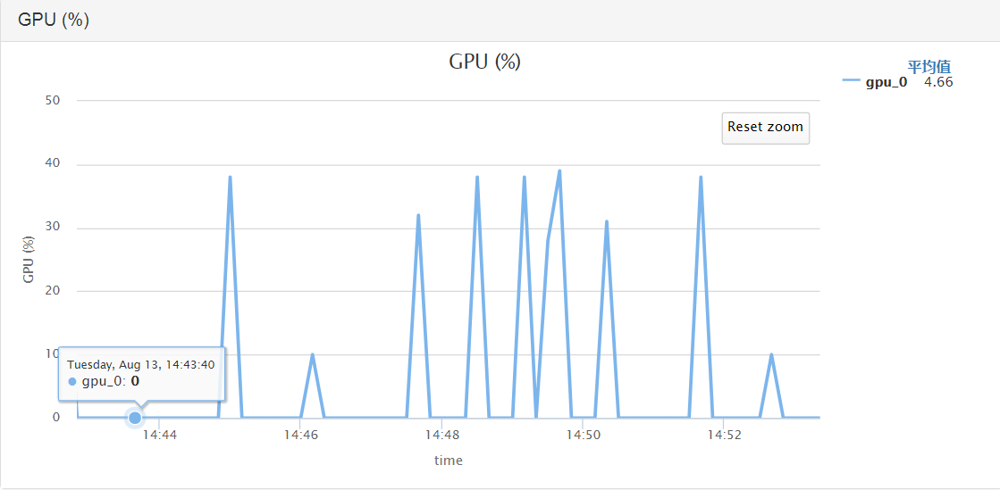
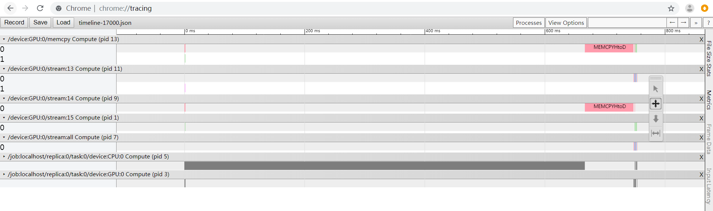
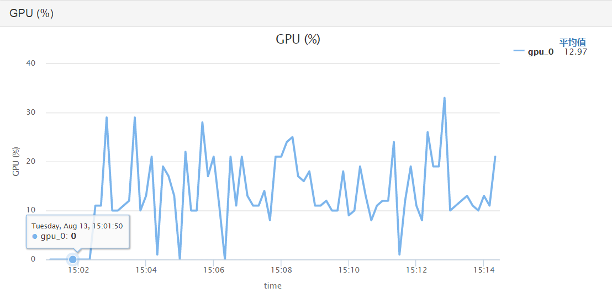

1. 

2. tensorflow 的api变化 （estimator api 和 session api的区别）

   现在tensorflow的api其实相当繁杂。主要分为低阶的和高阶的。

   低阶的一般就是早期的书上的，或者是tutorial上例子上的，包括一些主要的概念：tensor， graph， session等。

   Tensor：

   tensor，tensor包含 constant， variable， placeholder， 一定属于一个graph。

   Graph：

   在Tensorflow中，始终存在一个默认的Graph，当你创建Operation、Tensor时，tensorflow会将你这些节点和边自动添加到这个默认Graph中。

   但是如果有多个图，不同的计算图上的张量和运算彼此分离，互不干扰。我正经遇到过一个报错，说两个tensor属于不同的图，不能在一起运算。

   为什么要使用多个graph？

   如果使用加载单个模型的方式去加载多个模型，那么就会出现变量冲突的错误，也无法工作。这个问题的原因是因为一个默认图的缘故。冲突的发生是因为我们将所有变量都加载到当前会话采用的默认图中。当我们采用会话的时候，我们可以通过`tf.Session(graph=MyGraph)`来指定采用不同的已经创建好的图。因此，如果我们希望加载多个模型，那么我们需要做的就是把他们加载在不同的图，然后在不同会话中使用它们。

   Session:

   session则会管理整个计算的资源。session 拥有和管理物理资源 CPU和GPU、网络连接的功能。其中config参数，主要的功能就是分配计算任务到计算资源。

   allow_soft_placement 如果指定为 TRUE，那么 session 就会自动把不适合在 GPU 上运行的 OP 全部放到 CPU 上运行；cluster_def 是分布式运行时候需要指定的配置；gpu_options.allow_growth 设置会使得程序在开始时候逐步的增长 GPU 显存使用量，而不是一开始就最大化的使用所有显存。第一个和第三个配置是经常用到的

   下面这段代码是tutorial上的一段低阶api的示例代码，在高阶api中， 一般会把session和graph的概念隐藏起来

   ```python
   import tensorflow as tf
   
   # 构造一个线性模型 graph
   x = tf.placeholder("float", [None, 2])
   y = tf.placeholder("float", [None])
   
   b = tf.Variable(tf.zeros([1]))
   W = tf.Variable(tf.random_uniform([1, 2], -1.0, 1.0))
   y = tf.matmul(W, x_data) + b
   
   loss = tf.reduce_mean(tf.square(y - y_data))
   optimizer = tf.train.GradientDescentOptimizer(0.5)
   train = optimizer.minimize(loss)
   
   # 初始化变量
   init = tf.initialize_all_variables()
   
   # 启动图 (graph)
   sess = tf.Session()
   sess.run(init)
   
   # 使用 NumPy 生成假数据(phony data), 总共 100 个点
   import numpy as np
   x_data = np.float32(np.random.rand(2, 100)) # 随机输入
   y_data = np.dot([0.100, 0.200], x_data) + 0.300
   
   for step in xrange(0, 201):
       sess.run(train, feed_dict={x:x_data, y:y_data})
       if step % 20 == 0:
           print step, sess.run(W), sess.run(b)
   ```


   高阶API有Keras， slim，tflearn， TensorLayer, estimator。 超级繁杂，很多功能一样的api，再加上python没有go_to_definition 所以，在查文档和源码的时候简直要吐血。相对来说pytroch的api非常一致清晰，有很多人劝入。但是目前考虑到tensorflow先入为主了，使用的人多生态好，这一点占核心优势所以我觉得还是觉得如果要选还是选tensorflow吧

   其中slim我稍微看了一下api，感觉主要用在cv领域的api比较多，而且现在好像已经被抛弃了。tflearn, TensorLayer都是封装了一些繁琐的底层接口。可读性要好。总体来说封装层次上

   TensorLayer < tflearn < keras

   我搜了一些网上的评价，TensorLayer 的评价最高。但是相关的文章和博客搜到的不多，estimator api相反是搜到的比较多，且一些官方提供的模型都是用estimator实现的。所以TF 1.x 上 estimator是主流。TF 2.0 是基于TF1.13这个版本改的，基本上和这个版本的兼容性很高。TF2.0 提倡的是eager-first and keras-first。 主要还是提高易用性和可调试的能力。但是我个人不喜欢keras，因为封装的太厉害了。

2. tensorflow 的数据读取方式

   <https://www.cnblogs.com/demian/p/8005407.html>

   <https://juejin.im/post/5ba4b2a7f265da0ab719aa7e>

   dataset api

   Dataset API会使用C++的多线程机制，会比基于python的queue_runner（受限于python的多线程低性能）的开销更低

   - 原始 tf.data 数据输入代码： ~150 图像 / 秒
   - 管道化的 tf.data 数据输入代码： ~1,750 图像 / 秒 => **12倍的性能！**

   实现多线程读取前

   
   

   实现多线程读取后

   

3. tensorboard的使用和理解方式

4. tensorflow的一些基本概念（静态图|动态图， 和pytroch的对比）

5. tensorflow的模型inference

   - 离线推理

     由于画像主要是离线推理，目前采取两种办法：

     1. 把特征数据转化成csv的行形式，通过单行解析构造tf.train.Example，然后用from_saved_model加载export的模型来推理
     2. 通过estimator的predict接口，消费input_fn来进行推理 （tf_on_yarn上 分为利用worker和chief 节点来推理）
        * worker上节点进行推理，加载模型时，默认会从ps节点拉去模型，当模型参数过大或者worker数量过大时，可能会**导致PS 节点OOM**。 需要从worker上直接从模型目录加载模型（opal已经提供了这种模式）。
        * chief节点上进行推理，模型本来在chief，无需大量通信，但是仅仅为单节点，**推理速度太慢**
6. tensorflow的一些基本源码解析

   1. [高阶API的介绍](https://zhuanlan.zhihu.com/p/38470806) , session 是怎么被estimator封装起来的

   2. 

   3. Head 是什么 ? estimator_spec 是什么， model_fn是什么？hook是什么? global_step 是什么，起到什么作用

      答： 

      + Head是形象的指模型结构的头部，输入logits，Head把计算prediction, loss等操作封装起来，最终返回一个estimator_spec， 不同的head返回的estimator_spec不同，比如BinaryHead和MulticlassHead和RegressionHead不同。

      + model_fn是自定义estimator的核心，model_fn会返回一个estimator_spec（调用head.create_estimator_spec），在Prediction|Train|Eval三种mode下。

        + Prediction_mode 仅返回 predictions (logits, probabilities, class_ids, classes)

        + Eval_mode 返回 prediction，metric

        + Train Model 返回 train_op, loss

      + Estimator 获取到estimator_spec以后，调用_train_with_estimator_spec进行训练，这时候就回到传统的session.run的api这个级别了。
      + hook 是插入到session.run中的回调钩子，可用于写summary或者log，计算global_step等。global_step用于记录优化了多少步的一个tensor，用于了解优化的进度，以及控制是否结束迭代

7. 相关工具的使用

   1. tfgdb能解决什么问题？ <https://zhuanlan.zhihu.com/p/33264569>

8. 相关细节问题：

   1. tf.Variable 和 tf.get_variable的区别<https://blog.csdn.net/js54100804/article/details/80463520>
   2. 参数初始化 https://www.cnblogs.com/denny402/p/6932956.html

